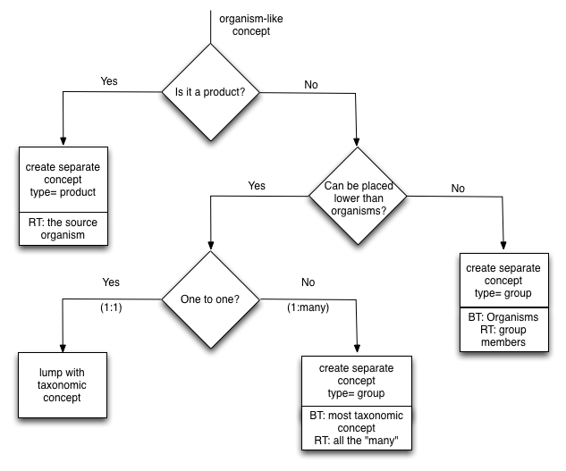

Concepts of type "organism" are 29% of GACS Beta 1.6.  Of these, 
over 83% have a scientific name as prefLabel. The remaining 17%
includes:

* __common names__: goats, lizards, ducks, shrimps, honey bees, 
  mangolds.

* __names of organism groups__: young animals, plant parasitic nematodes,
  aquatic insects, small ruminants, farmed fish, macroinvertebrates, racing
  animals, rodents, pets, cash crops.

* __names of special kinds of organism__: stallions, kids, weanlings, bitches,
  beef bulls, yearlings, ewes, ducklings, germ-free animals, herds,
  fish larvae.

The scientific names of organisms are markedly "translinguistic" -- i.e., they
are often used unchanged across a broad range of world languages.  Scientific
names may be expressed as "Latinate" (Latin or Latin-like) phrases, such as
"Tsuga canadensis" or "Picea engelmannii".  Exceptions include viruses, which
are translingually named in English, e.g., "Foot-and-mouth disease virus".  If
the goal of GACS were to provide a definitive database for species or taxons,
it might follow relevant standards such as Darwin Core, which designates
scientific names with a special property.  In order to meet the simpler use
cases of bibliographic indexing, GACS follows the thesaurus paradigm of
concepts with preferred and alternate labels.  Insofar as scientific names are
translingual, they are considered in GACS as belonging to no language in
particular.  Labels with scientific names are tagged with a code, 'zxx',
defined in ISO 639-2 and ISO 639-3 for content that is not specific to any
language (@cite).

In GACS, the distinction between preferred and alternative labels is largely
orthogonal to the distinction between scientific and common names.  A
scientific name may be the preferred label (e.g., "Leptinotarsa decemlineata")
and the corresponding common name the alternative ("Colorado potato beetle").
Vice versa, the common name may be preferred ("dogs") and the scientific name
alternative ("Canis lupus familiaris"). 

For example:

    ----------------------------------------------------------------------------------------
    | Condition                    | prefLabel                 | altLabel                  |
    |------------------------------|---------------------------|---------------------------|
    | 1:1 Common to Species Name   | __Species__               | __Common__                |
    |                              | Leptinotarsa decemlineata | Colorado potato beetle    |
    |                              | Camelus bactrianus        | Bactrian camel            |
    |                              | Quercus rubra             | Northern red oak          |
    | 1:N Common to Species Name   | __Species__               | __Common__                |
    |                              | Campanula                 | Bluebells                 |
    |                              | Barleria                  |                           |
    |                              | Mertensia                 |                           |
    |                              | Eustoma                   |                           |
    |                              | Hyacinthoides             |                           |
    ----------------------------------------------------------------------------------------

Lori Finch prepared a note about [common names and Latin names in
GACS](https://github.com/agrisemantics/gacs-qip/blob/master/documentation/Common_Names_and_Latin_Names-GACS.docx).
